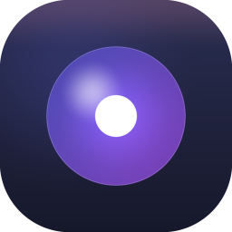
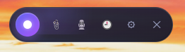
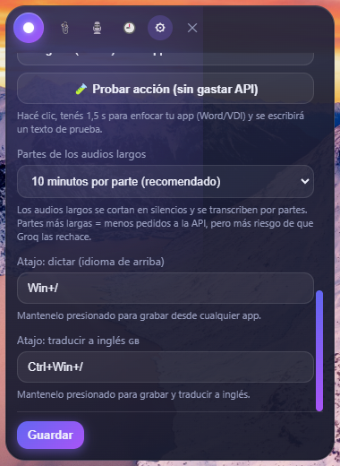
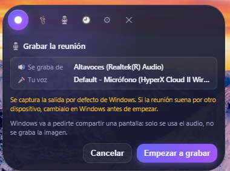
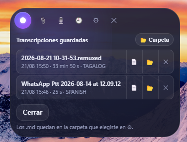
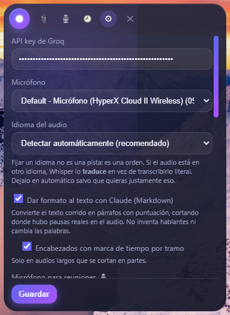

<div align="center">



# VozLibre2

**Píldora flotante de transcripción de voz para Windows.**
Mantené una tecla, hablá, y el texto aparece donde estés escribiendo.



[⬇️ Descargar la última versión](https://github.com/Arkhand/VozLibre2/releases/latest)

</div>

---

## Qué es

Una ventana chiquita que flota siempre encima de todo. No tiene barra de título, no ocupa lugar en la barra de tareas y vive en la bandeja del sistema. Presionás el atajo desde **cualquier** aplicación — Word, el navegador, un VDI, WhatsApp —, hablás, soltás, y el texto transcripto se pega solo en la app que tenías adelante.

Usa **Whisper large-v3** a través de [Groq](https://groq.com), que es rapidísimo y tiene una capa gratuita generosa.

## Instalación

1. Descargá `VozLibre2-1.0.0-portable.exe` desde [Releases](https://github.com/Arkhand/VozLibre2/releases/latest).
2. Ejecutalo. **No requiere instalación**: es portable, lo podés dejar donde quieras.
3. La primera vez se abre sola la configuración: pegá tu API key de Groq (abajo te explico cómo sacarla), tocá **🔗 Probar** para verificarla y **Guardar**.

> Windows puede mostrar un aviso de SmartScreen porque el .exe no está firmado. **Más información → Ejecutar de todas formas**.
>
> **¿Por qué pide tanto?** La app escucha el teclado a nivel global para detectar el atajo de dictado (push-to-talk) desde cualquier ventana, y simula pulsaciones para escribir el texto en la app activa. Eso es lo que hace que funcione en Word, el navegador o un VDI sin integrarse con cada uno. No registra lo que tipeás: solo mira si la tecla del atajo está presionada.

### Cómo obtener la API key de Groq (es gratis)

1. Entrá a **[console.groq.com](https://console.groq.com)** y creá una cuenta (podés usar Google o GitHub).
2. En el menú lateral, andá a **API Keys** — link directo: **[console.groq.com/keys](https://console.groq.com/keys)**.
3. Clic en **Create API Key**, ponele un nombre cualquiera (por ejemplo `VozLibre`) y confirmá.
4. Copiá la clave que aparece — empieza con `gsk_`. **Solo se muestra una vez**, así que copiala en ese momento.
5. En VozLibre2, abrí ⚙ y pegala en el campo **API key de Groq**. Clic en **Guardar**.

La clave se guarda en tu PC (`%APPDATA%\VozLibre2\settings.json`), **cifrada** con el almacén de Windows (DPAPI: solo tu usuario en tu máquina puede leerla), y no viaja a ningún lado salvo a la propia API de Groq.

## Uso básico: dictar

Es **push-to-talk**: mantenés presionado el atajo mientras hablás y lo soltás al terminar.

| Atajo | Qué hace |
|---|---|
| `F8` (configurable) | Dicta en el idioma configurado |
| `F9` (configurable) | Dicta y **traduce a inglés** |

Los dos atajos se reasignan desde ⚙ presionando la combinación que quieras. Funcionan por tecla **física**, así que andan con cualquier distribución de teclado.

<div align="center">

</div>

Si no se detecta voz, la app avisa y **no gasta API**.

### Qué hace con el texto

En ⚙ → **Al reconocer el texto** elegís entre:

- **Solo mostrarlo** — queda en la píldora, a un clic de 📋.
- **Pegarlo (Ctrl+V) en la app activa** — lo más cómodo para el día a día.
- **Simular pulsaciones de teclado** — para apps que bloquean el pegado (VDI, Citrix, algunos formularios).

Hay un botón **🧪 Probar acción** que escribe un texto de prueba sin gastar API, para verificar que funcione en tu app antes de dictar en serio.

## Todo lo que podés hacer

Los botones de la barra, de izquierda a derecha:

| | Función |
|---|---|
| 🔘 | **Grabar**: mantené presionado para dictar (equivale al atajo) |
| 📎 | **Transcribir un archivo** de audio o video |
| 🎙️ | **Grabar una reunión** (Teams, Zoom, Meet…) |
| 🕘 | **Historial** de transcripciones guardadas |
| ⚙ | **Configuración** |
| ✕ | **Ocultar** (la app queda en la bandeja del sistema) |

### 📎 Transcribir audios y videos

Elegí un archivo con 📎 o **arrastralo y soltalo** sobre la píldora. Sirve para notas de voz de WhatsApp (`.ogg`), grabaciones largas, y también **videos** (`.mp4`, `.mkv`, `.mov`): extrae el audio automáticamente.

Los archivos largos se **cortan en partes por los silencios reales** del audio (no a lo bruto cada N minutos), se comprimen y se transcriben parte por parte, concatenando el texto. Podés seguir usando la PC mientras trabaja.

> Para videos y audios largos hace falta **[ffmpeg](https://ffmpeg.org/download.html)** instalado en el sistema. Las notas de voz cortas no lo necesitan.

El texto de un archivo **nunca** se pega ni se teclea automáticamente: estás mirando la píldora, no tu documento. Queda a un clic de 📋.

### 🎙️ Grabar reuniones

<div align="center">

</div>

Graba **dos pistas por separado** y las intercala por tiempo para reconstruir la conversación:

- **"Reunión"** — el audio del sistema (todos los demás).
- **"Yo"** — tu micrófono.

Así sabés quién habló sin necesidad de diarización: la etiqueta sale de **qué dispositivo capturó cada palabra**, no de una adivinanza sobre el contenido.

Funciona con cualquier app (Teams, Zoom, Meet, lo que sea) porque captura el audio a nivel del sistema, y anda con auriculares o con la PC en silencio. Windows va a pedirte compartir una pantalla: **solo se usa el audio, no se graba la imagen**.

Se transcribe por partes **mientras grabás**, así que al cortar el texto ya está casi listo. Cada trozo se corta esperando un silencio (nadie hablando) para no partir una frase por la mitad, y cada frase lleva su marca de tiempo real, así las dos pistas se intercalan en el orden en que se habló. Si usás parlantes abiertos, el eco de tu micrófono se detecta y descarta.

### 🕘 Historial

<div align="center">

</div>

Cada archivo transcripto (y cada reunión) se guarda como un `.md` en `Documentos\VozLibre` (carpeta configurable). Si el texto pasó por el formateo con Claude, al lado queda también el **crudo** en un `.crudo.md`, tal cual lo devolvió Whisper. Desde el historial abrís el formateado (📄), el crudo (📝), la carpeta (📂), o lo borrás — el borrado manda los dos a la **Papelera de reciclaje**, no se pierde.

El dictado con atajo no se guarda: es de usar y tirar.

### ✨ Formateo a Markdown

Whisper devuelve un choclo de texto corrido. Si tenés el [CLI de Claude Code](https://claude.com/claude-code) instalado, VozLibre2 lo usa para convertirlo en párrafos con puntuación.

Importante: **no inventa hablantes ni reescribe tus palabras**. Los cortes de párrafo salen de los silencios reales que ffmpeg midió en el audio. El modelo solo puntúa y arma párrafos.

En audios largos partidos en tramos puede agregar encabezados con marca de tiempo (`### [12:34]`).

## Configuración

<div align="center">

</div>

| Opción | Para qué |
|---|---|
| **API key de Groq** | Tu clave `gsk_…` |
| **Micrófono** | Cuál usar para dictar |
| **Idioma del audio** | Dejalo en **automático** salvo que sepas lo que hacés (ver abajo) |
| **Modelo de transcripción** | `whisper-large-v3-turbo` (rápido, recomendado) o `whisper-large-v3` (algo más preciso). Traducir usa siempre large-v3 |
| **Formato Markdown** | Párrafos y puntuación vía Claude CLI |
| **Micrófono para reuniones** | Puede ser distinto al del dictado (típicamente los auriculares) |
| **Confirmar antes de grabar** | Evita arrancar una reunión sin querer |
| **Guardar historial** | Un `.md` por archivo o reunión (más el `.crudo.md` si se formateó), y en qué carpeta |
| **Al reconocer el texto** | Mostrar / pegar / teclear |
| **Iniciar con Windows** | Arranca oculta en la bandeja al iniciar sesión |
| **Buscar actualizaciones / Logs** | Consulta la última versión en GitHub; abre la carpeta de logs para pedir ayuda |
| **Partes de los audios largos** | Duración de cada trozo (10 min es lo recomendado) |
| **Atajos** | Se asignan presionando la combinación |

> ⚠️ **Sobre el idioma**: fijar un idioma no es una pista para Whisper, es una **orden**. Con "Español" seleccionado, un audio en inglés vuelve *traducido* al español en vez de transcripto literal. Por eso el default es **detectar automáticamente**.

## Preguntas frecuentes

**¿Cuánto cuesta?** Groq tiene capa gratuita con límites diarios que alcanzan de sobra para uso personal. El costo es solo el de la API — la app no cobra nada.

**¿Se sube mi audio a algún lado?** Solo a la API de Groq para transcribir. No hay servidor propio ni telemetría.

**¿Anda sin internet?** No: la transcripción la hace Groq en la nube.

**¿La ✕ cierra la app?** No, la oculta. Queda en la bandeja del sistema — clic derecho en el icono → **Salir** para cerrarla de verdad.

**¿Puedo moverla?** Sí, arrastrándola de la barra. Y se puede redimensionar.

**¿Necesito ffmpeg?** Solo para videos y audios de más de 25 MB. Si falta, la app avisa al arrancar y ofrece instalarlo con un clic (winget). El dictado, las notas de voz y las reuniones andan sin él.

**¿Necesito Claude Code?** No. Es opcional: sirve para que las reuniones y los archivos se guarden con párrafos y puntuación en vez de texto corrido. Sin él, todo lo demás funciona igual; la app lo avisa la primera vez.

**Algo no anda, ¿qué te mando?** Abrí ⚙ → **📂 Logs** y adjuntá `vozlibre.log` (está en `%APPDATA%\VozLibre2\logs`). Ahí queda cada error con su hora, sin tu API key.

**¿Cómo me entero de versiones nuevas?** La app consulta las [releases de GitHub](https://github.com/Arkhand/VozLibre2/releases) al arrancar y avisa si hay una más nueva (no descarga nada sola). También desde ⚙ → **🔄 Buscar actualizaciones**.

## Desarrollo

```bash
npm install
npm start          # correr en modo dev
npm test           # suite de tests (node:test)
npm run dist       # sube el patch de versión y genera el .exe portable en dist/
```

**Publicar una versión**: `npm run dist` incrementa solo la versión de `package.json` (1.0.0 → 1.0.1) antes de compilar, así cada .exe sale con un número distinto. Después, creá una release en GitHub con el tag `v1.0.1` y adjuntá el `.exe`: el chequeo de actualizaciones de la app compara contra ese tag. `npm run dist:same-version` compila sin tocar la versión.

**Idioma de la interfaz**: los textos están preparados para traducirse (`src/i18n/`). Por ahora solo hay español; para agregar un idioma, `npm run i18n:extract` lista todas las frases y `src/i18n/es.js` explica el formato.

**Stack**: Electron 26, `uiohook-napi` para los atajos globales (keycodes físicos, con keyup real para el push-to-talk), `@nut-tree-fork/nut-js` para el Ctrl+V, `koffi` para teclear Unicode llamando a `SendInput` de Win32 directo (sin PowerShell de por medio).

**Tests**: `npm test` corre la suite con `node:test` (sin dependencias): filtro de alucinaciones, cortes por silencio, intercalado de reuniones y formateo.

**Estructura**:

```
main.js              orquestador del proceso principal
src/main/            window, hotkeys, typing, settings, ipc,
                     audio (ffmpeg), format (Claude CLI), history, tray,
                     log (archivo), update (GitHub releases), autostart
src/i18n/            i18n.js (t(), estilo gettext) + diccionarios por idioma
test/                suite con node:test
src/renderer/        UI, grabación, llamada a Groq, reuniones
```

> Si después de `npm run dist` la app falla al arrancar con `npm start`, es porque electron-builder recompiló los módulos nativos contra otra ABI. `npm install` los deja como estaban.

## Licencia

MIT — Daniel Musial
